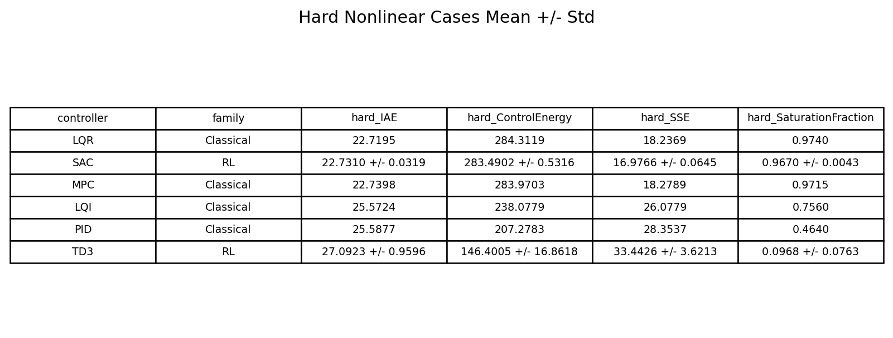

# DRL-DC-Motor-Control

DC motor speed-control benchmark comparing classical control and deep reinforcement learning under the same plant model, constraints, disturbances, and reference scenarios.

This repository is organized as an engineering project first: build the motor model, define benchmark cases, train RL agents, compare them against classical baselines, and inspect the resulting figures and summary tables.

## What This Project Does

The repository studies speed tracking for a DC motor using:

- `PID`
- `LQR`
- `LQI`
- `MPC`
- `TD3`
- `SAC`
- residual RL variants built on top of classical controllers

The main research goal is not only to train RL controllers, but to test whether they remain competitive when evaluated fairly against strong classical baselines on the same benchmark.

## Main Finding

The strongest result in this repository is not direct end-to-end RL. The most competitive setup is a hybrid controller where `SAC` learns a bounded residual correction on top of a nominal `LQR` controller, with curriculum training and checkpoint selection.

In practical terms:

- direct RL alone is weaker and less stable than strong classical baselines
- residual RL is much more competitive
- classical controller quality still matters, because the learned residual depends on the backbone it corrects

## Benchmark Setup

All controllers are evaluated on the same operating conditions and reference scenarios.

Plant conditions:

- `nominal`
- `ra_plus_50`
- `j_plus_50`
- `friction`
- `saturation`
- `combined_stress`

Reference scenarios:

- `step_nominal`
- `step_load_disturbance`
- `ramp`
- `sine`

Scenario details:

- `step_nominal`: constant reference `100 rad/s`
- `step_load_disturbance`: constant reference `100 rad/s`, with a `0.02 N*m` load torque step applied at `0.2 s` and held to the end of the `0.5 s` episode
- `ramp`: `r(t) = min(200 t, 120)` rad/s
- `sine`: `r(t) = 100 + 20 sin(2*pi*2*t)` rad/s, with mean `100 rad/s`, amplitude `20 rad/s`, and frequency `2 Hz`

Primary metrics:

- `IAE`
- `ISE`
- `SSE`
- `ControlEnergy`
- `SaturationFraction`
- `RiseTime`
- `SettlingTime`
- `Overshoot`

## Repository Structure

Main folders:

- [`python_td3_experiments`](python_td3_experiments): Python benchmark, training, comparison, and plotting pipeline
- `Reinforcement-Learning-controller-for-a-DC-motor-main`: earlier project materials
- root MATLAB/Simulink files: model-building, controller design, and earlier evaluation scripts

Most users should start with:

- [`python_td3_experiments/dc_motor_env.py`](python_td3_experiments/dc_motor_env.py)
- [`python_td3_experiments/experiment1_train_td3_many_seeds.py`](python_td3_experiments/experiment1_train_td3_many_seeds.py)
- [`python_td3_experiments/experiment2_add_controllers.py`](python_td3_experiments/experiment2_add_controllers.py)
- [`python_td3_experiments/compare_sac_td3_classical.py`](python_td3_experiments/compare_sac_td3_classical.py)
- [`python_td3_experiments/generate_residual_sac_report_graphs.py`](python_td3_experiments/generate_residual_sac_report_graphs.py)

## Workflow

### Step 1: Define the Motor Environment

The benchmark environment is implemented in:

- [`python_td3_experiments/dc_motor_env.py`](python_td3_experiments/dc_motor_env.py)

This file defines:

- motor parameters
- plant-condition perturbations
- reference scenarios
- disturbance timing and magnitude
- reward support for direct and residual RL control

### Step 2: Train RL Agents

Use:

- [`python_td3_experiments/experiment1_train_td3_many_seeds.py`](python_td3_experiments/experiment1_train_td3_many_seeds.py)

This script supports:

- `TD3`
- `SAC`
- `DDPG`
- residual control modes such as residual `LQR`
- multi-seed training
- curriculum scheduling
- expert warm-start

### Step 3: Add Classical Baselines

Use:

- [`python_td3_experiments/experiment2_add_controllers.py`](python_td3_experiments/experiment2_add_controllers.py)

This produces side-by-side benchmark results for classical and RL controllers under the same test cases.

### Step 4: Select the Best RL Checkpoints

Use:

- [`python_td3_experiments/select_best_rl_checkpoint.py`](python_td3_experiments/select_best_rl_checkpoint.py)

This step is important because final training reward alone is not a reliable indicator of final closed-loop quality.

### Step 5: Build Cross-Controller Summaries

Use:

- [`python_td3_experiments/compare_sac_td3_classical.py`](python_td3_experiments/compare_sac_td3_classical.py)

This script builds the overall and hard-case comparison summaries used in the final analysis.

### Step 6: Generate Report Figures

Use:

- [`python_td3_experiments/generate_residual_sac_report_graphs.py`](python_td3_experiments/generate_residual_sac_report_graphs.py)

This script generates report-ready:

- learning curves
- winner counts
- summary tables
- training-stage plots

## Selected Generated Figures

### Overall Comparison


### Hard-Case Comparison


### Training Behavior


### Controller Comparison


### Backbone Comparison


### Residual Backbone Training Curves

These plots show the training behavior of residual `SAC-MPC` and residual `SAC-H-infinity` under the same broader backbone-comparison workflow.


### Summary Tables

The repository also keeps rendered table figures for quick inspection of the main summary statistics.




## Best Current Result

Best current setup:

- `SAC`
- `residual_lqr`
- `MPC` warm-start
- curriculum training
- `10` seeds
- `100000` steps per seed
- validation-based best-checkpoint selection

Representative overall summary:

| Controller | Family | Seeds | Mean IAE | Mean Energy | Mean SSE |
|---|---|---:|---:|---:|---:|
| Residual SAC | RL hybrid | 10 | **15.7019** | 202.4493 | **6.2263** |
| LQR | Classical | - | 15.7137 | 202.0997 | 6.7328 |
| MPC | Classical | - | 15.7381 | 201.7797 | 6.8053 |
| TD3 | RL | 10 | 20.4985 | 154.1465 | 20.9578 |

Interpretation:

- residual RL can improve final convergence while staying close to strong classical tracking
- direct RL is clearly less reliable than the best hybrid setup
- the classical backbone remains a major determinant of overall tracking quality

## How To Reproduce

### Train the Best Residual SAC Setup

```powershell
& "C:\Users\Nathnael Biresaw\AppData\Local\Programs\Python\Python311\python.exe" `
  "python_td3_experiments\experiment1_train_td3_many_seeds.py" `
  --algorithm SAC `
  --control-mode residual_lqr `
  --residual-voltage-limit 8 `
  --expert-warmstart-steps 20000 `
  --expert-controller mpc `
  --curriculum nominal_to_hard `
  --seeds 10 `
  --timesteps 100000 `
  --chunk-timesteps 50000 `
  --print-every-steps 10000 `
  --training-condition-mode hard `
  --training-scenario-mode hard_tracking `
  --reward-profile balanced `
  --output-dir "python_td3_experiments\outputs\residual_sac_curriculum_mpcwarm_10seeds_100k"
```

### Select Best Checkpoints

```powershell
& "C:\Users\Nathnael Biresaw\AppData\Local\Programs\Python\Python311\python.exe" `
  "python_td3_experiments\select_best_rl_checkpoint.py" `
  --run-dir "python_td3_experiments\outputs\residual_sac_curriculum_mpcwarm_10seeds_100k" `
  --algorithm SAC `
  --control-mode residual_lqr `
  --residual-voltage-limit 8
```

### Generate Final Controller Comparisons

```powershell
& "C:\Users\Nathnael Biresaw\AppData\Local\Programs\Python\Python311\python.exe" `
  "python_td3_experiments\compare_sac_td3_classical.py" `
  --sac-dir "python_td3_experiments\outputs\residual_sac_curriculum_mpcwarm_10seeds_100k\best_selected" `
  --td3-dir "python_td3_experiments\outputs\experiment4_condition_aware_10seeds_100k" `
  --classical-csv "python_td3_experiments\outputs\experiment2_more_controllers_full_rl\controller_metrics_long.csv" `
  --output-dir "python_td3_experiments\outputs\residual_sac_curriculum_mpcwarm_10seeds_100k_best_comparison"
```

### Generate Report Figures

```powershell
& "C:\Users\Nathnael Biresaw\AppData\Local\Programs\Python\Python311\python.exe" `
  "python_td3_experiments\generate_residual_sac_report_graphs.py"
```

## Notes

- Large checkpoint archives are intentionally not tracked in Git.
- The repository focuses on source code, generated figures, and summary outputs.
- If you need the full paper package, keep it outside the public repo or share it separately.
