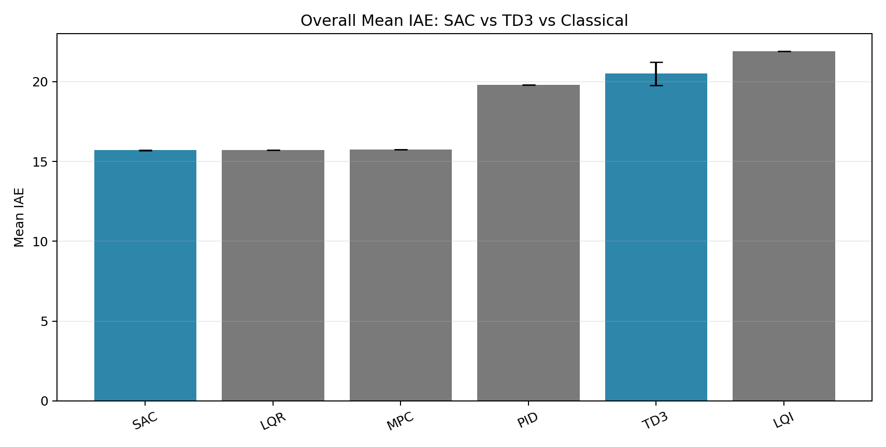
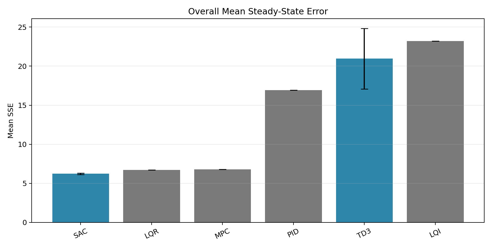
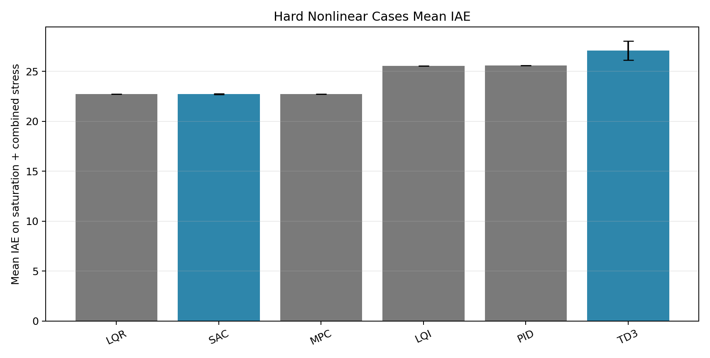
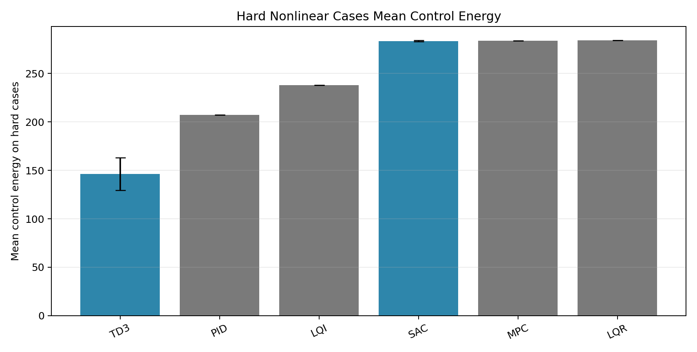
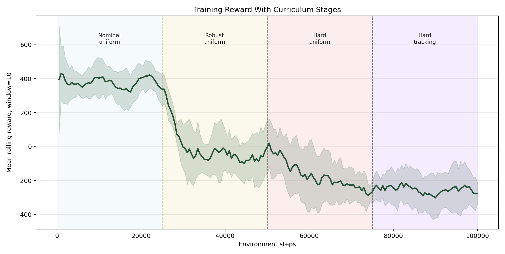
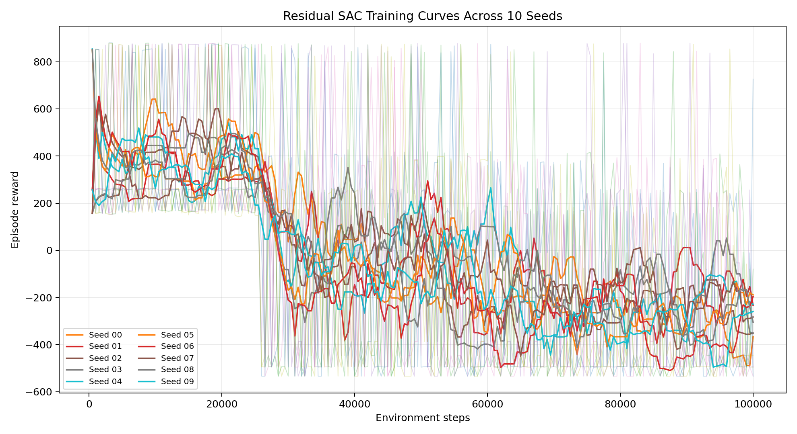
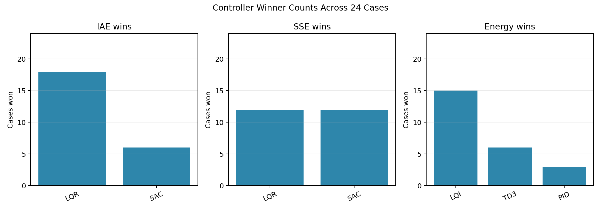
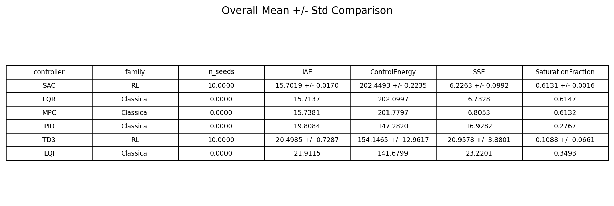

# DRL-DC-Motor-Control

This repository studies DC motor speed control with both classical controllers and deep reinforcement learning.

The main goal of the project is not only to train RL controllers, but to test them fairly against strong classical baselines under the same motor model, disturbances, nonlinearities, voltage limits, and reference signals.

## Paper Materials

For the submitted paper, a public-safe editable figure package is available in:

- [`paper_extract/editable_figures_package`](paper_extract/editable_figures_package)

It includes:

- exported figure files used in the paper
- figure-generation source scripts and LaTeX files
- benchmark-definition code, including the operating-condition setup in `dc_motor_env.py`
- lightweight summary CSV files and winner tables
- an operating-condition note with the exact reference and load-disturbance values used in the benchmark

The package does not include the previously uploaded ZIP bundle or the heavier raw combined-monitor CSV files. The public repo now keeps a smaller reproducibility-oriented set of paper materials.

## Project Focus

This work compares:

- `PID`
- `LQR`
- `LQI`
- `MPC`
- `TD3`
- `SAC`
- `Residual SAC over LQR`

The final and strongest result in this repository is a **residual SAC controller**:

- SAC does not directly command the full motor voltage
- instead, it learns a bounded correction on top of a nominal `LQR` controller
- training is improved with:
  - expert replay warm-start from `MPC`
  - a `nominal -> robust -> hard -> hard_tracking` curriculum
  - best-checkpoint validation selection

## Final Result

The best final experiment is:

- `Residual SAC over LQR`
- `MPC warm-start`
- `curriculum training`
- `10 seeds`
- `100000` steps per seed
- `best checkpoint selected per seed`

Overall mean performance:

| Controller | Family | Seeds | Mean IAE | IAE Std | Mean Energy | Energy Std | Mean SSE | SSE Std |
|---|---:|---:|---:|---:|---:|---:|---:|---:|
| Residual SAC | RL | 10 | **15.7019** | **0.0170** | 202.4493 | 0.2235 | **6.2263** | **0.0992** |
| LQR | Classical | - | 15.7137 | - | 202.0997 | - | 6.7328 | - |
| MPC | Classical | - | 15.7381 | - | 201.7797 | - | 6.8053 | - |
| PID | Classical | - | 19.8084 | - | 147.2820 | - | 16.9282 | - |
| TD3 | RL | 10 | 20.4985 | 0.7287 | 154.1465 | 12.9617 | 20.9578 | 3.8801 |
| LQI | Classical | - | 21.9115 | - | 141.6799 | - | 23.2201 | - |

What this means:

- the **selected residual SAC setup slightly outperformed standalone LQR and MPC on mean IAE**
- it also achieved **lower steady-state error**
- compared with direct TD3 and direct SAC training, the residual approach was much more competitive and much more stable across seeds

Important interpretation:

- this is **not** a claim that pure SAC from scratch beat LQR
- the successful result is a **hybrid controller**: classical control + residual RL

## Result Figures

These graphs are rendered directly from the final experiment outputs stored in this repository.

### Overall Benchmark Summary





### Hard Nonlinear Cases





### Training Curves





### Comparison Summary





## Evaluation Setup

All controllers are evaluated on the same benchmark cases.

Plant conditions:

- `nominal`
- `ra_plus_50`
- `j_plus_50`
- `friction`
- `saturation`
- `combined_stress`

Reference scenarios:

- `step_nominal`
- `step_load_disturbance`
- `ramp`
- `sine`

Scenario details used in the benchmark:

- `step_nominal`: constant reference `100 rad/s`
- `step_load_disturbance`: constant reference `100 rad/s`, with a `0.02 N*m` load torque step applied at `0.2 s` and held to the end of the `0.5 s` episode
- `ramp`: `r(t) = min(200 t, 120)` rad/s
- `sine`: `r(t) = 100 + 20 sin(2*pi*2*t)` rad/s, i.e. mean `100 rad/s`, amplitude `20 rad/s`, frequency `2 Hz`

Primary metrics:

- `IAE` - main tracking metric
- `ISE`
- `SSE` - steady-state / final error
- `ControlEnergy`
- `SaturationFraction`
- `RiseTime`
- `SettlingTime`
- `Overshoot`

## Main Python Package

The Python experiment pipeline lives in:

- [`python_td3_experiments`](python_td3_experiments)

Important scripts:

- `dc_motor_env.py`
  The Gymnasium DC motor environment, including nonlinear perturbations and residual-LQR mode.
- `experiment1_train_td3_many_seeds.py`
  Multi-seed RL training runner for `TD3`, `SAC`, and `DDPG`.
- `experiment2_add_controllers.py`
  Classical and RL controller comparison script.
- `select_best_rl_checkpoint.py`
  Validation-based checkpoint selector.
- `compare_sac_td3_classical.py`
  Builds the final mean +/- std comparisons.
- `generate_residual_sac_report_graphs.py`
  Generates training graphs, summary tables, and report figures.

## Final Output Folders

Best 10-seed residual SAC training run:

- `python_td3_experiments/outputs/residual_sac_curriculum_mpcwarm_10seeds_100k`

Best-checkpoint comparison:

- `python_td3_experiments/outputs/residual_sac_curriculum_mpcwarm_10seeds_100k_best_comparison`

Report-ready graphs and tables:

- `python_td3_experiments/outputs/residual_sac_curriculum_mpcwarm_10seeds_100k_report_graphs`

These folders contain:

- training curves across seeds
- curriculum-stage reward plots
- mean +/- std summary tables
- hard-case comparison tables
- winner-count tables and charts
- per-seed selected-checkpoint tables

## Why Training Reward Becomes Negative

During curriculum training, the reward starts positive on easier nominal cases and later becomes negative on hard nonlinear tracking cases.

That does **not** mean the controller got worse.

Why:

- early episodes are easier
- later episodes include saturation and combined-stress cases
- the reward distribution changes with curriculum stage

For this reason, the final judgment is based on:

- validation `IAE`
- validation `SSE`
- `ISE`
- `ControlEnergy`
- `SaturationFraction`

not raw final episode reward alone.

## Reproducing the Best Result

Train 10 seeds of the best residual SAC setup:

```powershell
& "C:\Users\Nathnael Biresaw\AppData\Local\Programs\Python\Python311\python.exe" `
  "python_td3_experiments\experiment1_train_td3_many_seeds.py" `
  --algorithm SAC `
  --control-mode residual_lqr `
  --residual-voltage-limit 8 `
  --expert-warmstart-steps 20000 `
  --expert-controller mpc `
  --curriculum nominal_to_hard `
  --seeds 10 `
  --timesteps 100000 `
  --chunk-timesteps 50000 `
  --print-every-steps 10000 `
  --training-condition-mode hard `
  --training-scenario-mode hard_tracking `
  --reward-profile balanced `
  --output-dir "python_td3_experiments\outputs\residual_sac_curriculum_mpcwarm_10seeds_100k"
```

Select the best checkpoint for each seed:

```powershell
& "C:\Users\Nathnael Biresaw\AppData\Local\Programs\Python\Python311\python.exe" `
  "python_td3_experiments\select_best_rl_checkpoint.py" `
  --run-dir "python_td3_experiments\outputs\residual_sac_curriculum_mpcwarm_10seeds_100k" `
  --algorithm SAC `
  --control-mode residual_lqr `
  --residual-voltage-limit 8
```

Generate the final comparison:

```powershell
& "C:\Users\Nathnael Biresaw\AppData\Local\Programs\Python\Python311\python.exe" `
  "python_td3_experiments\compare_sac_td3_classical.py" `
  --sac-dir "python_td3_experiments\outputs\residual_sac_curriculum_mpcwarm_10seeds_100k\best_selected" `
  --td3-dir "python_td3_experiments\outputs\experiment4_condition_aware_10seeds_100k" `
  --classical-csv "python_td3_experiments\outputs\experiment2_more_controllers_full_rl\controller_metrics_long.csv" `
  --output-dir "python_td3_experiments\outputs\residual_sac_curriculum_mpcwarm_10seeds_100k_best_comparison"
```

Generate report graphs and table images:

```powershell
& "C:\Users\Nathnael Biresaw\AppData\Local\Programs\Python\Python311\python.exe" `
  "python_td3_experiments\generate_residual_sac_report_graphs.py"
```

## Repository Note

Large training checkpoint ZIP files are intentionally not tracked in Git. The repository keeps:

- reproducible code
- selected summary CSV results
- final report figures and tables
- a public-safe editable figure package for the paper

This keeps the project lightweight while preserving the important research outputs.
